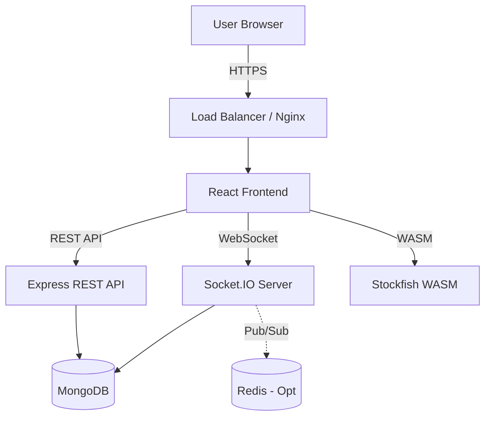

# Chess Application Architecture & System Design

## 1. High-Level Architecture
The system follows a classic **Client-Server** architecture with **Real-time** capabilities.

## 2. Component Breakdown

### Frontend (Client)
- **Framework**: React (Vite)
- **Styling**: Tailwind CSS
- **State Management**: React Context API
- **Chess Logic**:
    - `chess.js`: Validates moves, checks game status (checkmate, draw).
    - `react-chessboard`: Handles the visual board and drag-and-drop interactions.
    - `stockfish.wasm`: Runs locally in the browser for Analysis/PvC to save server costs.

### Backend (Server)
- **Runtime**: Node.js
- **Framework**: Express.js
- **Real-time Engine**: Socket.IO
    - Handles ephemeral game events (`move`, `time_update`).
    - broadcast updates to rooms.
- **Database**: MongoDB
    - Persists user data, game history (PGN), and puzzles.

## 3. Data Flow
1.  **Auth**: User logs in -> JWT issued -> Stored in HttpOnly Cookie or LocalStorage.
2.  **Matchmaking**: User joins queue -> Server searches for match -> Creates Game ID -> Emits `game_start`.
3.  **Gameplay**:
    - User A moves -> Client defines valid move? (Yes) -> Emit `move` event.
    - Server receives `move` -> Validates? (Yes) -> Update Game State -> Emit `move` to User B.
    - User B receives `move` -> Update UI.

## 4. Security Considerations
- **Input Validation**: Never trust the client. Validate every move on the server using `chess.js` before broadcasting.
- **Rate Limiting**: Prevent socket spamming.
- **Sanitization**: Prevent XSS in chat (if implemented) and game PGNs.

## 5. Deployment Strategy
- **Frontend**: Vercel / Netlify (Global CDN).
- **Backend**: Heroku / Railway / AWS EC2.
- **Database**: MongoDB Atlas.
